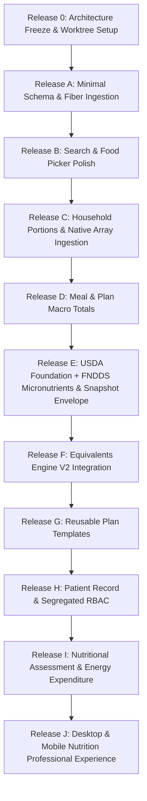

# TREVO ONE — NUTRITION PROFESSIONAL V2
## MASTER AUDIT + DATA ARCHITECTURE + PRODUCT PLAN
### RELEASE 0 — ARCHITECTURE FREEZE (DOCS-ONLY)

---

## 1. ESTADO INICIAL & ISOLAMENTO DE AMBIENTE GIT

### Identificação do Ambiente Git
- **BASE COMMIT (origin/main):** `a37420cfdddc11fa7a62b014de5311dd122018d5`
- **CURRENT WORKTREE:** `.worktrees/feat-nutrition-professional-v2`
- **CURRENT BRANCH:** `feat/nutrition-professional-v2`
- **PRESERVED BRANCH (Student Redesign):** `design/student-dashboard-v2` (preservada 100% intacta no repositório raiz com suas alterações uncommitted).
- **ALTERAÇÕES EM CÓDIGO-FONTE:** **NENHUMA (SOURCE CODE UNCHANGED)**
- **BANCO DE DADOS DEV / PROD:** **INALTERADOS (UNCHANGED / READ-ONLY)**
- **MIGRATIONS:** **NENHUMA EXECUTADA (MIGRATIONS: NONE)**
- **PUSH REMOTO:** **NÃO EXECUTADO (PUSH: NOT EXECUTED)**
- **ARQUIVO GERADO:** `implementation_plan.md` (Documento Mestre de Arquitetura e Planejamento)

---

## 2. AUDITORIA COMPLETA DO MÓDULO NUTRIÇÃO ATUAL

O ecossistema de Nutrição do Trevo One possui duas camadas arquiteturais implementadas no MySQL via Next.js App Router (Next.js 16 + React 19 + mysql2/promise):
1. **Nutrition V1 (Legado):** Estrutura baseada em grupos de escolha (`choice_groups`), seções e opções inspirada em cardápios de restaurantes/cantinas.
2. **Nutrition V2 (Atual):** Estrutura canônica prescritiva com planos versionados imutáveis (`nutrition_v2_plans` -> `nutrition_v2_plan_versions` -> `nutrition_v2_meals` -> `nutrition_v2_meal_items` -> `nutrition_v2_item_substitutions`), vinculação de alunos via `nutrition_v2_assignments`, catálogo unificado `nutrition_v2_foods` e motor determinístico de equivalentes `lib/nutrition-v2/equivalents.ts`.

### Mapeamento Detalhado por Estrutura

| Estrutura / Tabela | Finalidade (Purpose) | Dados Atuais / Volume | Relacionamentos | Tenancy | Autorização | Utilizado por | Risco de Regressão |
| :--- | :--- | :--- | :--- | :--- | :--- | :--- | :--- |
| **`nutrition_foods`** (V1) | Tabela legada de alimentos por consultoria | 548 registros importados via script TACO histórico | FK `consultancy_id`, FK `created_by_user_id` | Restrito por `consultancy_id` | Server Action V1 | `scripts/import-taco.mjs` (V1) | **BAIXO** (isolada do runtime V2) |
| **`nutrition_food_portions`** (V1) | Porções caseiras legadas | Subordinada a `nutrition_foods` | FK `food_id` | Indireto via food | Server Action V1 | V1 legado | **BAIXO** |
| **`nutrition_plans`** (V1) | Planos legados com status DRAFT/ACTIVE | Histórico legado | FK `consultancy_id`, FK `student_membership_id`, FK `nutritionist_membership_id` | `consultancy_id` | Server Action V1 | Histórico V1 | **BAIXO** (preservar leitura) |
| **`nutrition_meals`** (V1) | Refeições do plano V1 | Subordinada a `nutrition_plans` | FK `nutrition_plan_id` | Indireto via plan | Server Action V1 | Histórico V1 | **BAIXO** |
| **`nutrition_meal_items`** (V1) | Itens com snapshots de macros V1 | Subordinada a choice groups | FK `choice_group_id`, FK `food_id` | Indireto via meal | Server Action V1 | Histórico V1 | **BAIXO** |
| **`nutrition_v2_foods`** | Biblioteca unificada de alimentos (GLOBAL + CONSULTANCY) | 5.795 USDA ativos (Foundation + FNDDS) traduzidos + 548 TACO | FK `consultancy_id` (NULL se GLOBAL), FK `created_by_user_id`, FK `created_by_membership_id` | `scope` = 'GLOBAL' ou `scope` = 'CONSULTANCY' com `consultancy_id` | `assertCanAuthorNutrition` / `assertCanManageGlobal` | Food Picker, Food Library, Builder, Equivalents Modal | **ALTO** (núcleo da prescrição) |
| **`nutrition_v2_food_portions`** | Medidas caseiras e porções anexadas a alimentos V2 | Porções cadastradas por alimento | FK `food_id` -> `nutrition_v2_foods(id)` ON DELETE CASCADE | Indireto via food | `assertCanAuthorNutrition` | Food Picker, Plan Builder | **MÉDIO** |
| **`nutrition_v2_plans`** | Raiz estável de identidade do plano nutricional | Planos ativos e templates | FK `consultancy_id`, FK `created_by_membership_id` | `consultancy_id` estrito | `assertCanAuthorNutrition` | `/planos-v2`, Dashboard, Builder | **ALTO** |
| **`nutrition_v2_plan_versions`** | Versões imutáveis de prescrição (DRAFT, PUBLISHED, ARCHIVED) | Versões versionadas (`version_number` sequencial) | FK `nutrition_plan_id` -> `nutrition_v2_plans(id)` | Indireto via plan root | `assertCanAuthorNutrition` (mutações restritas a status='DRAFT') | Plan Builder, Version History, PDF Generator | **CRÍTICO** (imutabilidade de prescrições) |
| **`nutrition_v2_meals`** | Refeições ordenadas diretamente na versão do plano | Refeições com horário agendado | FK `nutrition_plan_version_id` -> `nutrition_v2_plan_versions(id)` ON DELETE CASCADE | Indireto via version | `assertCanAuthorNutrition` | Plan Builder, Aluno Cardápio, PDF | **ALTO** |
| **`nutrition_v2_meal_items`** | Itens prescritos diretamente com snapshots de macros | Alimentos prescritos com quantidade e unidade | FK `meal_id`, FK `food_id` (SET NULL) | Indireto via meal | `assertCanAuthorNutrition` | Plan Builder, Aluno Cardápio, Equivalents, PDF | **CRÍTICO** (snapshots nutricionais) |
| **`nutrition_v2_item_substitutions`** | Substituições diretas 1:N por item | Alternativas alimentares com snapshots | FK `meal_item_id`, FK `food_id` (SET NULL) | Indireto via meal item | `assertCanAuthorNutrition` | Plan Builder, Equivalents Modal, Aluno Cardápio | **ALTO** |
| **`nutrition_v2_assignments`** | Vinculação autoritativa entre versão publicada e aluno | Atribuições ativas (`ACTIVE`, `ENDED`) | FK `consultancy_id`, FK `student_membership_id`, FK `nutrition_plan_version_id`, FK `assigned_by_membership_id` | `consultancy_id` e `student_membership_id` | Server-side autoritativo | Aluno `/nutricao`, PDF Aluno, Dashboard Aluno | **CRÍTICO** (visão do aluno) |
| **`student_progress_entries`** | Histórico biométrico e evolução corporal | Registros de pesagens e circunferências | FK `consultancy_id`, FK `student_membership_id`, FK `created_by_user_id` | `consultancy_id` estrito | Aluno próprio ou Profissional/Admin | `/progresso`, Evolution 360, Dashboard | **ALTO** |
| **`student_intake_submissions`** | Formulários de anamnese e avaliação física (JSON) | Submissões de onboarding com dados clínicos | FK `consultancy_id`, FK `membership_id`, FK `user_id` | `consultancy_id` estrito | Admin / Profissional da consultoria | Onboarding, Anamnese | **MÉDIO** (base do prontuário) |
| **`consultations`** | Atendimentos e teleconsultas 1:1 | Agendamentos presenciais e virtuais | FK `consultancy_id`, FK `student_membership_id`, FK `professional_membership_id` | `consultancy_id` estrito | Profissional vinculado / Aluno participante | `/consultas`, Teleconsulta, Preflight | **CRÍTICO** (manter WebRTC/preflight) |

---

## 3. PRESERVAÇÃO ESTRITA DE PLANOS EXISTENTES

### Análise da Persistência Atual de Planos
Em `nutrition_v2_meal_items` e `nutrition_v2_item_substitutions`, cada item prescrito armazena:
- `food_id`: ID relacional da tabela `nutrition_v2_foods` (com cláusula `ON DELETE SET NULL`).
- `prescribed_quantity`: Quantidade numérica (DECIMAL(10,2)).
- `prescribed_unit_code`: Código da unidade (`G`, `KG`, `ML`, `L`, `UNIDADE`, `FATIA`, `COLHER_SOPA`, `COLHER_CHA`, `XICARA`, `SCOOP`, `PORCAO`).
- `prescribed_unit_label`: Rótulo amigável exibido ao aluno (ex: "g", "Colher(es) de sopa", "Fatia média").
- `food_name_snapshot`: Nome do alimento congelado no momento da prescrição (VARCHAR(255)).
- `category_snapshot`: Categoria do alimento congelada (VARCHAR(100)).
- `calories_kcal_snapshot`: Calorias calculadas e congeladas no ato da inclusão (DECIMAL(8,2)).
- `protein_g_snapshot`: Proteína calculada e congelada (DECIMAL(8,2)).
- `carbohydrate_g_snapshot`: Carboidrato calculado e congelado (DECIMAL(8,2)).
- `fat_g_snapshot`: Gordura calculada e congelada (DECIMAL(8,2)).

### Regras de Compatibilidade e Não Regressão
1. **Existing Plan Compatibility: 100% GARANTIDA.**
2. Planos publicados e atribuídos a alunos utilizam **exclusivamente os snapshots** para exibição ao aluno, cálculo de totais diários e renderização de PDF.
3. Se um alimento da base for alterado, renomeado, reclassificado ou arquivado na biblioteca:
   - Os planos já criados ou publicados **NUNCA são recalculados automaticamente nem sofrem mutação retroativa**.
   - As versões publicadas permanecem idênticas ao momento em que foram emitidas pelo nutricionista.
4. Qualquer ampliação do modelo de nutrientes (ex: adição de fibras e micronutrientes) é aditiva com valor padrão `NULL`, mantendo todos os snapshots legados íntegros sem migração destrutiva.

---

## 4. SNAPSHOT DE MICRONUTRIENTES VERSIONADO

### Decisão Arquitetural
Adotar a coluna `micronutrients_snapshot_json` em `nutrition_v2_meal_items` e `nutrition_v2_item_substitutions`.
Para garantir auditabilidade e reprodutibilidade clínica absoluta ao longo dos anos, os dados não serão gravados como um array solto, mas sim dentro de um **Envelope Versionado e Tipado**.

### Contrato do Envelope Versionado (JSON Schema v1)

```json
{
  "schemaVersion": 1,
  "sourceUid": "USDA:FOUNDATION:171688",
  "sourceVersion": "Foundation 04/2026",
  "capturedAt": "2026-09-23T12:00:00.000Z",
  "dataQuality": "ANALYTICAL_GOLD",
  "sourceType": "EXTERNAL",
  "nutrients": [
    {
      "code": "FIBER",
      "value": 3.4,
      "unit": "g",
      "status": "KNOWN"
    },
    {
      "code": "IRON",
      "value": 1.2,
      "unit": "mg",
      "status": "KNOWN"
    },
    {
      "code": "VIT_C",
      "value": 0.0,
      "unit": "mg",
      "status": "ZERO_ANALYZED"
    },
    {
      "code": "VIT_B12",
      "value": null,
      "unit": "mcg",
      "status": "UNKNOWN"
    }
  ]
}
```

### Avaliação de Campos Complementares de Proveniência

| Campo | Tipo | Valores Permitidos | Finalidade Clínica & Forense |
| :--- | :--- | :--- | :--- |
| `schemaVersion` | `number` | `1` | Permite migração transparente de schema no leitor de snapshots sem quebrar dados passados |
| `sourceUid` | `string` | e.g. `USDA:FOUNDATION:171688`, `USDA:FNDDS:2705383`, `TACO:4:12` | Rastreabilidade exata do registro de origem no momento da prescrição |
| `sourceVersion` | `string` | e.g. `Foundation 04/2026`, `FNDDS 2021-2023` | Identifica qual release do dataset originou os dados calculados |
| `capturedAt` | `string` (ISO 8601) | e.g. `2026-09-23T12:00:00.000Z` | Timestamp imutável da captura do snapshot |
| `dataQuality` | `string` | `ANALYTICAL_GOLD`, `SURVEY_RECIPE`, `USER_MANUAL`, `MANUFACTURER_DECLARED` | Classificação do rigor metodológico da fonte original |
| `sourceType` | `string` | `EXTERNAL`, `CUSTOM`, `HYBRID` | Identifica se a fonte foi pública canônica, customizada pela consultoria ou calculada |

### Semântica dos Status de Nutriente
- `KNOWN`: Nutriente quantificado analiticamente ($> 0$).
- `ZERO_ANALYZED`: Nutriente testado em laboratório com valor comprovadamente zero ($0,0$).
- `TRACE`: Nutriente detectado abaixo do limite de quantificação ($< \text{LOQ}$).
- `UNKNOWN`: Nutriente não analisado / não reportado pela fonte original (`null`).
- **Regra de Ouro:** `UNKNOWN ≠ ZERO`.

### Garantia de Auditabilidade
Um plano publicado continua 100% auditável mesmo que:
- O USDA publique novas versões de dados;
- O alimento de origem seja editado ou deletado da biblioteca;
- O script importador seja reescrito;
- O catálogo de micronutrientes do Trevo One evolua para novos códigos.

---

## 5. MIGRATION SAFETY & DATABASE ENGINE

### Auditoria do Ambiente Hostinger
- **DATABASE ENGINE:** `InnoDB`
- **DEFAULT CHARSET:** `utf8mb4`
- **COLLATE:** `utf8mb4_unicode_ci`
- **DATABASE NAME (DEV):** `u406031981_trevoone_dev`
- **DATABASE NAME (PROD):** `u406031981_trevoone`
- **HOST:** `srv1595.hstgr.io`
- **MYSQL VERSION:** Hostinger MariaDB 10.11 / MySQL 8.0 compatível.
- **RESTRIÇÃO DE CONECTIVIDADE REMOTA:** Servidores de banco da Hostinger bloqueiam conexões externas diretas de IPs de desenvolvimento dinâmicos (`ER_ACCESS_DENIED_ERROR`) através de regras rígidas de firewall/allowlist. Conexões de produção ocorrem internamente entre o runtime Node.js da aplicação e o serviço local/interno do MySQL.

### Status e Volumetria das Tabelas de Itens de Refeição

| Tabela | Engine | Row Count Estimado (DEV) | Tamanho de Dados | Colunas Existentes |
| :--- | :--- | :--- | :--- | :--- |
| **`nutrition_v2_meal_items`** | `InnoDB` | Baixo (< 1.000 linhas) | < 1 MB | 16 colunas com snapshots de macros |
| **`nutrition_v2_item_substitutions`** | `InnoDB` | Baixo (< 1.000 linhas) | < 1 MB | 14 colunas com snapshots de macros |
| **`nutrition_v2_foods`** | `InnoDB` | 6.343 linhas (5.795 USDA + 548 TACO) | ~3 MB | 28 colunas |

### Correção de Premissas sobre DDL e Locks
- **Remoção de Premissas Irrealistas:** Fica expressamente removida qualquer afirmação de que "ADD COLUMN JSON é instantâneo / sem lock".
- Em InnoDB, `ADD COLUMN ... JSON` em versões de MySQL / MariaDB pode exigir reconstrução de tabela (`COPY` algorithm) dependendo da versão exata e do posicionamento da coluna.
- **ESTIMATED MIGRATION RISK:** **`LOW-TO-MEDIUM`**.
  - O volume de linhas atual é reduzido, resultando em tempo de execução de milissegundos a poucos segundos.
  - No entanto, qualquer DDL em produção deve ser executado em janela de baixo tráfego, através do runner oficial `scripts/migrate-db.mjs` com transações controladas e verificação estrita de runtime (`SELECT DATABASE()`).

---

## 6. MICRONUTRIENTES — AUDITORIA EXATA: FOUNDATION + FNDDS

### Correção Crítica da Release E
A Release E **NÃO será limitada ao Foundation Foods**.
O dataset FNDDS 2021-2023 contém **5.432 alimentos** com composição analítica/estimada completa para a esmagadora maioria dos micronutrientes essenciais. Deixar o FNDDS nutricionalmente cego seria uma falha grave de produto.
Portanto, a Release E realizará a ingestão de micronutrientes para **ambos os datasets (USDA Foundation + FNDDS)**, preservando a devida proveniência e nível de qualidade dos dados.

### Auditoria Exata dos Datasets Locais Oficiais

- **Dataset Foundation Foods:** `FoodData_Central_foundation_food_json_2026-04-30.json` (395 alimentos).
- **Dataset Survey Foods (FNDDS):** `surveyDownload.json` FNDDS 2021-2023 release 2024-10-31 (5.432 alimentos).

### Tabela de Cobertura Exata de Micronutrientes

| Nutriente | Código USDA | Foundation (Total: 395) | FNDDS (Total: 5.432) | Cobertura FNDDS (%) | Observações Clínicas |
| :--- | :--- | :--- | :--- | :--- | :--- |
| **Fibra Alimentar** | 291 | 185 alimentos | **5.431 alimentos** | 99,98% | Essencial para cálculo de carboidratos líquidos |
| **Cálcio (Ca)** | 301 | 351 alimentos | **5.431 alimentos** | 99,98% | Saúde óssea e contração muscular |
| **Ferro (Fe)** | 303 | 351 alimentos | **5.431 alimentos** | 99,98% | Prevenção de anemias |
| **Magnésio (Mg)** | 304 | 351 alimentos | **5.431 alimentos** | 99,98% | Metabolismo energético e recuperação |
| **Fósforo (P)** | 305 | 351 alimentos | **5.431 alimentos** | 99,98% | Homeostase celular e óssea |
| **Potássio (K)** | 306 | 351 alimentos | **5.431 alimentos** | 99,98% | Balanço eletrolítico e pressão arterial |
| **Sódio (Na)** | 307 | 333 alimentos | **5.431 alimentos** | 99,98% | Monitoramento de hipertensão e retenção |
| **Zinco (Zn)** | 309 | 351 alimentos | **5.431 alimentos** | 99,98% | Imunidade e síntese proteica |
| **Selênio (Se)** | 317 | 152 alimentos | **5.431 alimentos** | 99,98% | Função tireoidiana e antioxidante |
| **Vitamina A (RAE)** | 320 / 318 | 51 alimentos | **5.431 alimentos** | 99,98% | Visão, imunidade e diferenciação celular |
| **Vitamina C** | 401 | 111 alimentos | **5.431 alimentos** | 99,98% | Síntese de colágeno e absorção de ferro |
| **Vitamina D (D2+D3)** | 328 / 324 | 52 alimentos | **5.431 alimentos** | 99,98% | Fixação de cálcio e modulação imune |
| **Vitamina E** | 323 | 63 alimentos | **5.431 alimentos** | 99,98% | Proteção lipídica antioxidante |
| **Vitamina K** | 430 | 75 alimentos | **5.431 alimentos** | 99,98% | Coagulação e mineralização óssea |
| **Vitamina B1 (Tiamina)**| 404 | 169 alimentos | **5.431 alimentos** | 99,98% | Metabolismo de carboidratos |
| **Vitamina B2 (Riboflavina)**| 405 | 133 alimentos | **5.431 alimentos** | 99,98% | Respiração celular e cofator FAD |
| **Vitamina B3 (Niacina)**| 406 | 176 alimentos | **5.431 alimentos** | 99,98% | Reparo de DNA e cofator NAD/NADH |
| **Vitamina B5 (Ác. Pantotênico)**| 410 | 52 alimentos | **0 alimentos** | 0,00% | *WWEIA/FNDDS não inclui B5 no painel de 65 nutrientes* |
| **Vitamina B6** | 415 | 197 alimentos | **5.431 alimentos** | 99,98% | Metabolismo de aminoácidos e neurotransmissores |
| **Folato Total / DFE** | 417 / 435 | 123 alimentos | **5.431 alimentos** | 99,98% | Crítico para gestantes e divisão celular |
| **Vitamina B12** | 418 | 64 alimentos | **5.431 alimentos** | 99,98% | Hematopoiese e função neurológica |

### Justificativa Técnica para Vitamina B5 no FNDDS
A auditoria revelou que **5.431 de 5.432 alimentos do FNDDS possuem dados completos para 20 dos 21 nutrientes**. A única exceção é a Vitamina B5 (Ácido Pantotênico), presente apenas no Foundation Foods (52 alimentos). Isso ocorre porque a metodologia oficial do estudo *What We Eat In America* (WWEIA/FNDDS) monitora um painel fixo de 65 nutrientes que exclui o ácido pantotênico. O sistema do Trevo One registrará `status: UNKNOWN` para B5 nos alimentos FNDDS, sem inventar valores e mantendo total transparência.

---

## 7. PORTIONS — CONTAGEM EXATA DO DATASET LOCAL

Auditoria executada diretamente nos arquivos oficiais JSON descompactados:

| Métrica Auditada | Foundation Foods (2026-04-30) | Survey Foods FNDDS (2024-10-31) | Total Combinado |
| :--- | :--- | :--- | :--- |
| **FOODS TOTAL** | **395** | **5.432** | **5.827** |
| **FOODS WITH foodPortions** | **285** (72,15%) | **5.432** (100,00%) | **5.717** (98,11%) |
| **FOODS WITH valid gramWeight** | **285** (72,15%) | **5.432** (100,00%) | **5.717** (98,11%) |
| **PORTIONS TOTAL** | **383** | **22.194** | **22.577** |
| **PORTIONS INVALID** | **0** | **1** | **1** |
| **DUPLICATE PORTION LABELS** | **2** | **0** | **2** |
| **MISSING gramWeight** | **0** | **1** | **1** |

---

## 8. NORMALIZAÇÃO SEGURA DAS PORÇÕES CASEIRAS

### Auditoria da Representação USDA
- **Foundation Foods:** A porção é decomposta estruturadamente:
  - `amount`: valor numérico (ex: `1`, `5`).
  - `measureUnit`: objeto com `name` e `abbreviation` (ex: `cup`, `tomatoes`, `RACC`).
  - `modifier`: texto contextual opcional (ex: `"drained"`).
  - `gramWeight`: peso numérico em gramas (ex: `152`, `49.7`).
  - `portionDescription`: habitualmente nulo (o texto legível é composto: `amount + " " + measureUnit.name + (modifier ? ", " + modifier : "")`).
- **FNDDS (Survey Foods):** A porção traz o texto completo:
  - `portionDescription`: descrição textual formatada (ex: `"1 cup"`, `"1 individual school container"`, `"1 slice"`, `"Quantity not specified"`).
  - `gramWeight`: peso numérico em gramas (ex: `244`, `61`, `2.5`, `0`).
  - `modifier`: código numérico interno do FNDDS (ex: `"10205"`, `"90000"`).
  - `measureUnit`: genérico (`id: 9999, name: "undetermined"`).

### Pipeline de Normalização Segura

```
+-------------------------------------------------------------------------+
|                  Entrada: Porção USDA (Foundation / FNDDS)             |
+-------------------------------------------------------------------------+
                                     |
                                     v
+-------------------------------------------------------------------------+
| Regra 1: Validação de Peso                                              |
| - Se gramWeight for nulo, NaN ou <= 0:                                  |
|   -> Marcar como INVALID e NÃO exibir na lista de prescrição clínica   |
| - Se portionDescription == "Quantity not specified":                    |
|   -> Marcar como fallback não prescritivo                               |
+-------------------------------------------------------------------------+
                                     |
                                     v
+-------------------------------------------------------------------------+
| Regra 2: Mapeamento de Unidade Canônica (Apenas se Inequívoca)          |
| - "cup" / "xícara"              -> CANONICAL_UNIT = 'XICARA'            |
| - "tablespoon" / "tbsp"         -> CANONICAL_UNIT = 'COLHER_SOPA'       |
| - "teaspoon" / "tsp"            -> CANONICAL_UNIT = 'COLHER_CHA'        |
| - "slice" / "fatia"             -> CANONICAL_UNIT = 'FATIA'             |
| - "piece" / "unit" / "egg"      -> CANONICAL_UNIT = 'UNIDADE'           |
| - "scoop"                       -> CANONICAL_UNIT = 'SCOOP'             |
+-------------------------------------------------------------------------+
                                     |
                                     v
+-------------------------------------------------------------------------+
| Regra 3: Preservação de Descrições Complexas / Específicas             |
| - Se o texto for composto (ex: "1 cup, cooked, diced",                  |
|   "1 large single serving bag", "Guideline amount per cup hot cereal"): |
|   -> PRESERVAR a descrição original e traduzida                         |
|   -> ATRIBUIR display_pt_br adequado (ex: "1 xícara, cozido, picado")    |
|   -> REGISTRAR gramWeight específico daquele alimento                   |
|   -> NUNCA inventar enum canônico incorreto ou forçar enum inexistente |
+-------------------------------------------------------------------------+
```

---

## 9. PRONTUÁRIO CLÍNICO — REFINAMENTO DE OWNERSHIP & RBAC

### Princípio de Segregação
Acesso clínico a dados de saúde de pacientes exige autorização estrita server-side em conformidade com as resoluções do CFN (Conselho Federal de Nutricionistas) e com a LGPD (Lei Geral de Proteção de Dados - Art. 11 sobre dados sensíveis de saúde).
- **`CONSULTANCY_ADMIN` NÃO tem acesso clínico irrestrito por padrão.**
- **`PERSONAL` NÃO tem acesso a anotações clínicas privadas do nutricionista.**
- **`STUDENT` NÃO tem acesso a notas internas de trabalho do nutricionista.**

### Matriz Refinada de Categorias & Acesso

| Categoria | Descrição / Dados Contidos | STUDENT | NUTRITIONIST | PERSONAL | CONSULTANCY_ADMIN | PLATFORM_ADMIN |
| :--- | :--- | :--- | :--- | :--- | :--- | :--- |
| **`PATIENT_SUBMITTED`** | Respostas de formulários enviadas pelo aluno no onboarding (`student_intake_submissions`), peso/altura informados, queixas declaradas | **Leitura** dos próprios dados | **Leitura / Escrita** (validação clínica) | **Leitura** (se vinculado ao aluno) | **Leitura** (status de matrícula e preenchimento) | **NONE** |
| **`NUTRITIONIST_CLINICAL_PRIVATE`** | Anotações clínicas confidenciais do nutricionista, hipóteses diagnósticas nutricionais, histórico familiar privado | **NONE** | **Leitura / Escrita** (apenas nutricionista responsável) | **NONE** | **NONE** | **NONE** |
| **`NUTRITIONIST_SHARED`** | Orientações de conduta alimentar marcadas explicitamente pelo nutricionista como compartilháveis com o paciente | **Leitura** | **Leitura / Escrita** | **Leitura** | **NONE** | **NONE** |
| **`PROFESSIONAL_SHARED`** | Dados compartilhados para trabalho interdisciplinar (peso atual, percentual de gordura, metas de gasto calórico, restrições articulares) | **Leitura** | **Leitura / Escrita** | **Leitura / Escrita** (apenas membros vinculados) | **NONE** | **NONE** |
| **`ADMINISTRATIVE`** | Matrícula, status de vínculo, plano contratado, datas de consulta e presença em teleconsultas | **Leitura** | **Leitura** | **Leitura** | **Leitura / Escrita** | **NONE** |

---

## 10. COMPLETUDE DOS MICRONUTRIENTES (DATA COMPLETENESS)

### Aprovação da Metodologia C
A Metodologia C é aprovada exclusivamente sob a ótica de **DATA COMPLETENESS (Completude de Dados da Prescrição)** e **NÃO como "cobertura clínica"**.

### Exibição na Interface do Profissional
Exemplo para Ferro ($Fe$):
- **Subtotal Conhecido:** `14,2 mg`
- **Dados Disponíveis:** `5 de 6 alimentos prescritos possuem informação analítica`
- **Alimentos sem Informação:** `1 item sem dados de ferro na fonte de referência (ex: Queijo Artesanal da Fazenda)`

Quando todos os itens possuírem informação ($6 \text{ de } 6$):
- **Exibição:** `Composição disponível para todos os itens prescritos (100% de completude dos dados).`

### Separação Estrita de Adequação Clínica
- Este indicador de completude serve para informar o nutricionista se o cálculo está completo ou se há "pontos cegos" de nutrientes em algum ingrediente da receita.
- O indicador de completude **NÃO afirma adequação nutricional às DRI / RDA / AI**.
- A análise de adequação clínica a RDA/DRI constituirá um módulo analítico separado, ativado apenas após a homologação de tabelas de referência clínica validadas para a faixa etária, sexo e condição gestacional do paciente.

---

## 11. RELEASE A — PRECISE SCHEMA DIFF & MIGRATION MÍNIMA

### Auditoria do Estado Atual de `nutrition_v2_foods`

#### Colunas Atuais Existentes (28 colunas):
1. `id` BIGINT UNSIGNED NOT NULL AUTO_INCREMENT PRIMARY KEY
2. `public_id` CHAR(36) NOT NULL UNIQUE
3. `scope` VARCHAR(20) NOT NULL
4. `consultancy_id` BIGINT UNSIGNED NULL DEFAULT NULL
5. `name` VARCHAR(255) NOT NULL
6. `display_name_pt_br` VARCHAR(255) NULL DEFAULT NULL (adicionado na migration 026)
7. `normalized_display_name_pt_br` VARCHAR(255) NULL DEFAULT NULL (adicionado na migration 026)
8. `normalized_name` VARCHAR(255) NOT NULL
9. `category` VARCHAR(100) NULL DEFAULT NULL
10. `reference_amount` DECIMAL(10,2) NOT NULL DEFAULT 100.00
11. `reference_unit_code` VARCHAR(20) NOT NULL DEFAULT 'G'
12. `calories_kcal` DECIMAL(8,2) NULL DEFAULT NULL
13. `protein_g` DECIMAL(8,2) NULL DEFAULT NULL
14. `carbohydrate_g` DECIMAL(8,2) NULL DEFAULT NULL
15. `fat_g` DECIMAL(8,2) NULL DEFAULT NULL
16. `status` VARCHAR(20) NOT NULL DEFAULT 'ACTIVE'
17. `source_type` VARCHAR(50) NOT NULL DEFAULT 'MANUAL'
18. `source_key` VARCHAR(100) NULL DEFAULT NULL
19. `source_external_code` VARCHAR(100) NULL DEFAULT NULL
20. `source_version` VARCHAR(50) NULL DEFAULT NULL
21. `source_reference` VARCHAR(255) NULL DEFAULT NULL
22. `source_imported_at` DATETIME(3) NULL DEFAULT NULL
23. `source_uid` VARCHAR(255) NULL DEFAULT NULL UNIQUE
24. `created_by_user_id` BIGINT UNSIGNED NULL DEFAULT NULL
25. `created_by_membership_id` BIGINT UNSIGNED NULL DEFAULT NULL
26. `created_at` DATETIME(3) NOT NULL DEFAULT CURRENT_TIMESTAMP(3)
27. `updated_at` DATETIME(3) NOT NULL DEFAULT CURRENT_TIMESTAMP(3) ON UPDATE CURRENT_TIMESTAMP(3)
28. `deleted_at` DATETIME(3) NULL DEFAULT NULL

#### Índices e Chaves Únicas Atuais:
- `PRIMARY KEY (id)`
- `UNIQUE KEY uq_nutrition_v2_foods_public_id (public_id)`
- `UNIQUE KEY uq_nutrition_v2_foods_source_uid (source_uid)`
- `INDEX idx_n2f_scope_consultancy_status_del (scope, consultancy_id, status, deleted_at)`
- `INDEX idx_n2f_normalized_name (normalized_name)`
- `INDEX idx_n2f_category (category)`
- `INDEX idx_n2f_created_by_user (created_by_user_id)`
- `INDEX idx_n2f_created_by_membership (created_by_membership_id)`
- `INDEX idx_n2f_normalized_display_name_pt_br (normalized_display_name_pt_br)`

#### Campos de Proveniência JÁ Existentes (NÃO DUPLICAR):
- `source_type`
- `source_key`
- `source_external_code`
- `source_version`
- `source_reference`
- `source_imported_at`
- `source_uid`

#### Campos Ausentes Necessários para Release A:
1. `fiber_g`: `DECIMAL(8,2) NULL DEFAULT NULL` (campo de fibra alimentar indispensável para macronutrientes centrais e cálculo de carboidratos líquidos).
2. `data_quality`: `VARCHAR(30) NULL DEFAULT 'REFERENCE'` (classificação de qualidade e rigor analítico).
3. `last_verified_at`: `DATETIME(3) NULL DEFAULT NULL` (registro de data da última checagem de integridade).

### Proposta Exata de Migração Mínima para Release A
```sql
-- Migration: 029_nutrition_v2_foods_fiber_and_quality.sql
-- Description: Minimal additive schema enhancement for Nutrition V2 Release A
-- Additive only: preserves all existing foods, tenants, plans and snapshots untouched.

ALTER TABLE nutrition_v2_foods
    ADD COLUMN fiber_g DECIMAL(8,2) NULL DEFAULT NULL AFTER fat_g,
    ADD COLUMN data_quality VARCHAR(30) NOT NULL DEFAULT 'REFERENCE' AFTER source_type,
    ADD COLUMN last_verified_at DATETIME(3) NULL DEFAULT NULL AFTER source_imported_at;
```

### Escopo Estrito da Release A:
- Migration mínima aditiva acima;
- Ingestão de fibra alimentar (`fiber_g`) no importador oficial USDA;
- Metadados de qualidade (`dataQuality`) preservados;
- Idempotência testada;
- Suíte de testes automatizados executada.
- **NÃO incluir micronutrientes completos na Release A (permanecem na Release E).**

---

## 12. PLANO INCREMENTAL DE RELEASES REVISADO (A a J)



---

## 13. SÍNTESE FINAL DA RELEASE 0
A Release 0 encontra-se formalmente consolidada, documentada e pronta para encerramento, fornecendo todas as bases técnicas, matemáticas, jurídicas e operacionais necessárias para o início seguro da Release A.
